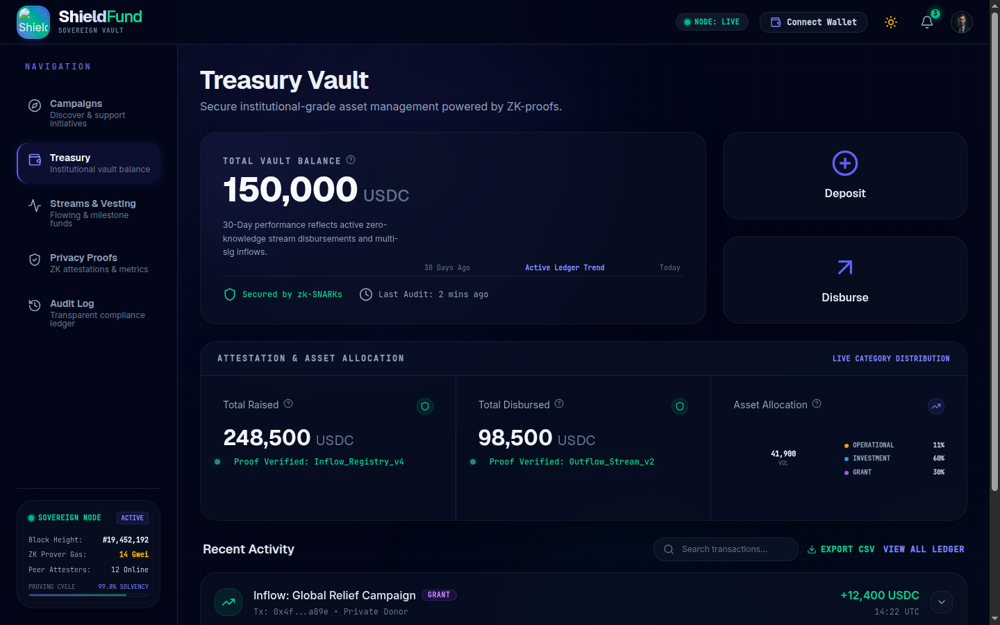
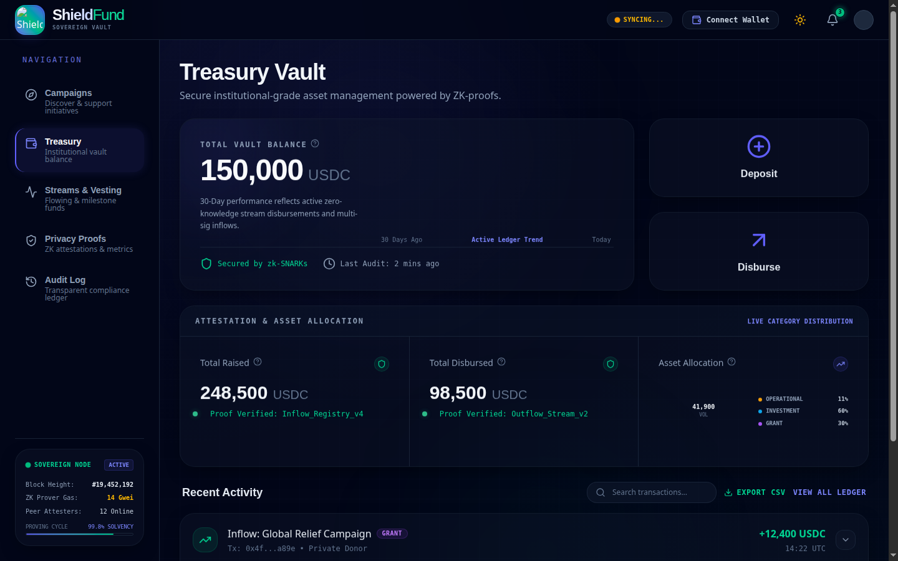

# ShieldFund Frontend


ZK-gated treasury dashboard for the Stellar / Soroban ecosystem. Manage multi-sig vaults, launch fundraising campaigns, stream real-time payments to contributors, and anchor zero-knowledge proofs on-chain — all from a single React interface connected to your Freighter wallet.

---

## Live Testnet Deployment

The contracts are live on **Stellar Testnet** and wired into this frontend. No extra config needed for testnet — just clone, `npm install`, and `npm run dev`.

| Contract | ID | Explorer |
|----------|----|---------|
| Treasury Vault | `CAUWJPC73YLQMSV6X4QPLUVS2UZFE2PMRIQSSCDN62DNN6J76Y5RETIG` | [View on Stellar Expert](https://stellar.expert/explorer/testnet/contract/CAUWJPC73YLQMSV6X4QPLUVS2UZFE2PMRIQSSCDN62DNN6J76Y5RETIG) |
| Streaming | `CDU7ZIVQ3UC4K3DHV3NMQGW5UMSYFCKCC6YJKHT4YLNEZJRWL6THE6WQ` | [View on Stellar Expert](https://stellar.expert/explorer/testnet/contract/CDU7ZIVQ3UC4K3DHV3NMQGW5UMSYFCKCC6YJKHT4YLNEZJRWL6THE6WQ) |
| Proof Registry | `CBDLHQQPKC5524CFWPD4HMPTZGWBYQNW3IKGAFH6IAYBU3F2F6AO2332` | [View on Stellar Expert](https://stellar.expert/explorer/testnet/contract/CBDLHQQPKC5524CFWPD4HMPTZGWBYQNW3IKGAFH6IAYBU3F2F6AO2332) |
| XLM Token SAC | `CDLZFC3SYJYDZT7K67VZ75HPJVIEUVNIXF47ZG2FB2RMQQVU2HHGCYSC` | [View on Stellar Expert](https://stellar.expert/explorer/testnet/contract/CDLZFC3SYJYDZT7K67VZ75HPJVIEUVNIXF47ZG2FB2RMQQVU2HHGCYSC) |
| Admin Account | `GBJ5FP5UB4YUE2EONTPPSAGKZZGDETFZLEJXJRCALSYTJZIDVWAN3C7P` | [View on Stellar Expert](https://stellar.expert/explorer/testnet/account/GBJ5FP5UB4YUE2EONTPPSAGKZZGDETFZLEJXJRCALSYTJZIDVWAN3C7P) |

> These IDs are already set in `src/lib/contracts.ts`. For mainnet or your own testnet deploy, update that file with your contract IDs from [shieldfund-contracts](https://github.com/Crowder-Stellar/shieldfund-contracts).

---

## Screenshots

**Treasury Vault** — Live balance, deposit/disburse, attestation & asset allocation charts



**ZK Proof Registry** — Submit and verify zero-knowledge proofs anchored on-chain



---

## Tech Stack

| Layer | Choice |
|-------|--------|
| Framework | React 19 |
| Build tool | Vite 6 |
| Styling | Tailwind CSS v4 |
| Charts | Recharts + D3 |
| Animations | Motion (Framer) |
| Wallet | Stellar Freighter API |
| Stellar SDK | `@stellar/stellar-sdk` v16 |
| Tests | Vitest + Testing Library |
| Language | TypeScript 5.8 |

---

## Work Breakdown Structure

```
shieldfund-frontend
│
├── Wallet Layer
│   ├── Freighter connect / disconnect
│   ├── Public key read + balance display
│   └── Transaction signing (all ops go through Freighter)
│
├── Contract Interaction (src/lib/stellar.ts)
│   ├── deposit()          → treasury_vault::deposit
│   ├── disburse()         → treasury_vault::disburse
│   ├── getStats()         → treasury_vault::get_stats
│   ├── createStream()     → streaming::create_stream
│   ├── getAccumulated()   → streaming::get_accumulated
│   ├── withdraw()         → streaming::withdraw
│   ├── registerProof()    → proof_registry::register_proof
│   └── verifyProofExists()→ proof_registry::verify_proof_exists
│
├── UI — 4 Main Tabs
│   ├── Treasury Tab
│   │   ├── Live vault balance card
│   │   ├── Attestation & allocation charts (Recharts)
│   │   ├── Recent activity feed
│   │   ├── Deposit Modal (amount input → Freighter sign)
│   │   └── Disburse Modal (recipient + proof hash → Freighter sign)
│   │
│   ├── Campaigns Tab
│   │   ├── Campaign list with progress bars
│   │   └── Launch Campaign Modal
│   │
│   ├── Streams Tab
│   │   ├── Real-time accumulating counters (50ms tick)
│   │   ├── Stream status badges (Active / Paused / Completed)
│   │   └── Create Stream Modal
│   │
│   └── Proofs Tab
│       ├── Proof submission form
│       ├── On-chain proof list with type badges
│       └── Manual Verification Modal
│
└── Supporting Components
    ├── Header — nav + wallet button
    ├── Sidebar — tab switcher
    ├── Notifications Panel — real-time event feed
    └── Audit Log Tab — transaction history
```

---

## Prerequisites

| Tool | Version | Install |
|------|---------|---------|
| Node.js | ≥ 20 | [nodejs.org](https://nodejs.org) |
| npm | ≥ 10 | bundled with Node |
| Freighter | latest | [freighter.app](https://www.freighter.app) browser extension |

> **Freighter is required** to sign Soroban transactions. Install it and create or import a Stellar testnet account before using the app.

---

## Quick Start

```bash
# 1. Clone
git clone https://github.com/Crowder-Stellar/shieldfund-frontend.git
cd shieldfund-frontend

# 2. Install
npm install

# 3. (Optional) copy env — testnet IDs are already filled in
cp .env.example .env

# 4. Start dev server
npm run dev
# → http://localhost:3000
```

The app connects to the live testnet contracts immediately — no extra setup required.

---

## How to Use the App

### 1. Connect Your Wallet
- Click **Connect Wallet** in the top-right header
- Freighter opens and asks you to approve the site
- Your Stellar public key and XLM balance appear in the header

> **Need testnet XLM?** Fund your account at [https://friendbot.stellar.org?addr=YOUR_ADDRESS](https://friendbot.stellar.org)

### 2. Treasury Tab — Deposit & Disburse
- **Deposit**: Click the blue **Deposit** button → enter an amount → Freighter signs the transfer into the vault contract
- **Disburse**: Click **Disburse** (admin only) → enter recipient address, amount, and the proof hash that justifies the payment → Freighter signs

The balance card updates live on every new ledger.

### 3. Campaigns Tab — Launch a Campaign
- Click **Launch Campaign** → fill in the title, goal amount, and description
- The campaign is recorded on-chain and appears in the list with a live progress bar

### 4. Streams Tab — Real-Time Payments
- Click **Create Stream** → enter recipient address, monthly rate (USDC/month), and end date
- The stream card shows a live counter ticking up in real-time (interpolated every 50ms between 5-second on-chain reads)
- Admin can **Pause / Resume** any stream
- Recipients click **Withdraw** to claim accumulated XLM

### 5. Proofs Tab — ZK Proof Registration
- Paste your Noir proof hash and public inputs hash
- Select the proof type: `payroll` | `operational` | `relief`
- Click **Submit Proof** — Freighter signs the `register_proof` call to the on-chain registry
- All registered proofs appear in the list with their Stellar Expert link

---

## Environment Variables

| Variable | Default | Description |
|----------|---------|-------------|
| `VITE_STELLAR_NETWORK` | `TESTNET` | `TESTNET` or `MAINNET` |
| `VITE_TREASURY_VAULT_CONTRACT_ID` | set | From [shieldfund-contracts](https://github.com/Crowder-Stellar/shieldfund-contracts) deploy |
| `VITE_STREAMING_CONTRACT_ID` | set | From deploy |
| `VITE_PROOF_REGISTRY_CONTRACT_ID` | set | From deploy |
| `VITE_API_BASE_URL` | `http://localhost:4000` | [shieldfund-backend](https://github.com/Crowder-Stellar/shieldfund-backend) URL |

---

## Available Scripts

```bash
npm run dev           # Dev server → http://localhost:3000
npm run build         # Production build → dist/
npm run preview       # Preview production build locally
npm run lint          # TypeScript type-check
npm run test          # Run tests once
npm run test:watch    # Watch mode
npm run test:ui       # Vitest browser UI
npm run clean         # Remove dist/
```

---

## Project Structure

```
shieldfund-frontend/
├── index.html
├── vite.config.ts
├── tsconfig.json
├── .env.example                          # Copy to .env — testnet IDs prefilled
├── docs/screenshots/                     # UI screenshots for README
│
└── src/
    ├── main.tsx                          # React root
    ├── App.tsx                           # Tab routing + global state
    ├── types.ts                          # Shared TypeScript interfaces
    ├── initialData.ts                    # Mock data (no contracts needed for local dev)
    ├── index.css                         # Tailwind + global styles
    │
    ├── components/
    │   ├── Header.tsx                    # Top bar + wallet connect
    │   ├── Sidebar.tsx                   # Left nav
    │   ├── TreasuryTab.tsx               # Vault balance, charts, activity
    │   ├── CampaignsTab.tsx              # Campaign list
    │   ├── StreamsTab.tsx                # Live stream counters
    │   ├── ProofsTab.tsx                 # ZK proof submission + list
    │   ├── AuditLogTab.tsx               # Transaction history
    │   ├── WalletModal.tsx               # Freighter connect UI
    │   ├── DepositModal.tsx              # Vault deposit form
    │   ├── DisburseModal.tsx             # Vault disburse form
    │   ├── LaunchCampaignModal.tsx
    │   ├── CreateStreamModal.tsx
    │   ├── ManualVerificationModal.tsx
    │   ├── NotificationsPanel.tsx
    │   └── EmptyState.tsx
    │
    ├── lib/
    │   ├── contracts.ts                  # ← Live contract IDs + network config
    │   └── stellar.ts                    # Soroban invocation helpers
    │
    └── test/
        ├── setup.ts
        ├── App.test.tsx
        ├── contracts.config.test.ts
        └── stellar.helpers.test.ts
```

---

## CI / CD

GitHub Actions runs on every push and PR:

| Step | Trigger |
|------|---------|
| Type-check | PR + push to main |
| Vitest tests | PR + push to main |
| Vite build | PR + push to main |
| Vercel preview deploy | PR only |
| Vercel production deploy | Push to main |

Add these secrets in GitHub → Settings → Secrets to enable Vercel deploys:
`VERCEL_TOKEN`, `VERCEL_ORG_ID`, `VERCEL_PROJECT_ID`, and all `VITE_*` contract ID secrets.

---

## Related Repos

- [shieldfund-contracts](https://github.com/Crowder-Stellar/shieldfund-contracts) — Soroban smart contracts (deploy here first)
- [shieldfund-backend](https://github.com/Crowder-Stellar/shieldfund-backend) — Express.js off-chain API
